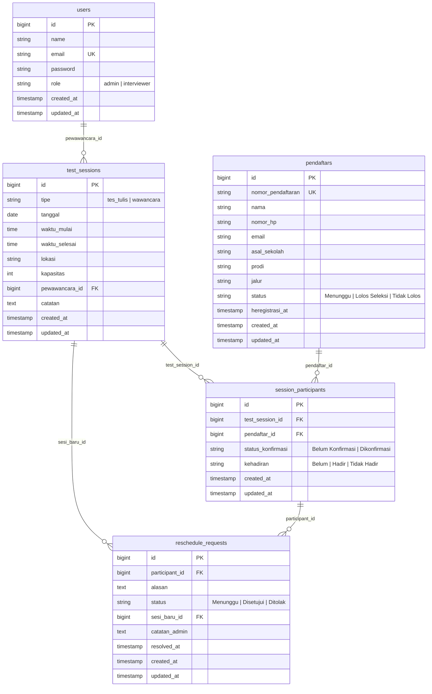

# Development Plan — Modul Penjadwalan Tes Seleksi PMB
## Vibe Coding & Venture SEVIMA

> **Nama**: Yusika Intan  
> **Tanggal**: 13 Juni 2026  
> **Modul**: Penjadwalan Tes Seleksi & Wawancara PMB  
> **Sistem Target**: Aplikasi PMB (React 18 + Laravel 12) — Existing  
> **Sumber Kode**: [admission-app-main](https://github.com/yusikaintan-afk/devplan-md)

---

## BAGIAN 1 — Analisa Teknis

### 1.1 Identifikasi Pengguna

| No | Pengguna | Peran dalam Modul Penjadwalan |
|----|----------|-------------------------------|
| 1 | **Admin PMB** | Sudah ada di sistem (tabel `users`, login via Sanctum dengan `name` atau `email` + password). **Peran baru**: membuat sesi jadwal tes/wawancara, meng-assign pendaftar berstatus "Lolos Seleksi" ke sesi, memantau konfirmasi & kehadiran, mengirim notifikasi pengingat, dan mengelola permintaan reschedule. |
| 2 | **Calon Mahasiswa (Pendaftar)** | Sudah ada di sistem (tabel `pendaftars`, akses publik via nomor pendaftaran `PMB-2025-XXXX`). **Peran baru**: melihat jadwal tes/wawancara yang sudah di-assign melalui halaman Cek Status, mengonfirmasi kehadiran, mengajukan reschedule jika berhalangan, dan menerima email pengingat. |
| 3 | **Pewawancara / Penguji** | **Pengguna baru** — belum ada di sistem. Ditambahkan ke tabel `users` yang sudah ada dengan pembeda kolom `role`. Peran: melihat sesi yang ditugaskan kepadanya, melihat daftar peserta per sesi, dan mencatat kehadiran peserta saat hari-H pelaksanaan. Berbeda dari admin karena hanya memiliki akses terbatas (read-only + catat kehadiran). |

---

### 1.2 Fitur Utama per Pengguna

#### Admin PMB

| No | Fitur | Deskripsi |
|----|-------|-----------|
| 1 | Buat Sesi Jadwal | Membuat sesi tes/wawancara baru dengan input: tanggal, waktu mulai & selesai, lokasi/ruangan, tipe (`tes_tulis` / `wawancara`), kapasitas maks, dan assign pewawancara |
| 2 | Auto-Assign Pendaftar | Menampilkan daftar pendaftar berstatus `Lolos Seleksi` (query dari tabel `pendaftars` yang ada) lalu assign ke sesi dengan validasi kapasitas |
| 3 | Kirim Notifikasi | Mengirim email notifikasi jadwal ke peserta (trigger manual + reminder otomatis H-1 via Laravel Queue) |
| 4 | Kelola Reschedule | Melihat daftar permintaan reschedule dan menyetujui (pilih sesi alternatif) atau menolak |
| 5 | Dashboard Kehadiran | Melihat ringkasan kehadiran per sesi: jumlah hadir, tidak hadir, belum konfirmasi, disajikan dalam statistics cards |

#### Calon Mahasiswa (Pendaftar)

| No | Fitur | Deskripsi |
|----|-------|-----------|
| 1 | Lihat Jadwal | Melihat jadwal tes/wawancara di halaman Cek Status yang sudah ada (`CekStatus.jsx`). Ditambah section baru di bawah info status pendaftaran |
| 2 | Konfirmasi Kehadiran | Mengonfirmasi bahwa akan hadir pada jadwal yang ditetapkan (tombol di halaman Cek Status) |
| 3 | Ajukan Reschedule | Mengajukan permintaan pindah jadwal dengan menyertakan alasan (maks 1 kali per sesi) |
| 4 | Terima Pengingat | Menerima email pengingat otomatis H-1 sebelum jadwal (dikirim oleh Laravel scheduled job) |

#### Pewawancara / Penguji

| No | Fitur | Deskripsi |
|----|-------|-----------|
| 1 | Lihat Jadwal Sesi | Melihat daftar sesi yang ditugaskan kepadanya setelah login |
| 2 | Lihat Peserta per Sesi | Melihat daftar peserta yang di-assign ke sesinya beserta status konfirmasi |
| 3 | Catat Kehadiran | Menandai peserta hadir/tidak hadir pada saat pelaksanaan tes (checkbox per peserta) |

---

### 1.3 Tech Stack yang Dipilih

Stack utama **tetap mengikuti** sistem yang sudah ada sesuai `skill.md`:
- **Frontend**: React 18 + Vite 5 + Tailwind CSS 3 (`http://localhost:5173`)
- **Backend**: Laravel 12 + Sanctum (`http://localhost:8000/api`)
- **Database**: SQLite (dev)
- **HTTP Client**: Fetch API via custom wrapper (`src/utils/api.js`)

Berikut komponen **tambahan** untuk modul penjadwalan:

| Komponen Tambahan | Teknologi | Alasan |
|-------------------|-----------|--------|
| Kalender / Datepicker | **React DatePicker** (`react-datepicker`) | Ringan, mudah di-style dengan Tailwind (warna biru `#1a56db` sesuai `skill.md`), UX intuitif untuk memilih tanggal & waktu sesi |
| Pengiriman Email | **Laravel Mail** + **Mailtrap** (dev) | Built-in di Laravel, tidak perlu dependensi eksternal. Mailtrap untuk testing agar tidak mengirim email sungguhan |
| Job Queue (Reminder) | **Laravel Queue** (`database` driver) | Untuk mengirim email pengingat H-1 secara async. Driver `database` supaya tidak perlu setup Redis — tabel `jobs` sudah ada dari migration bawaan Laravel (`create_jobs_table`) |
| Task Scheduling | **Laravel Task Scheduling** (`schedule:run`) | Cron-like scheduler bawaan Laravel untuk trigger pengiriman reminder setiap hari secara otomatis |
| Notifikasi UI | **React Hot Toast** (`react-hot-toast`) | Notifikasi ringan di frontend untuk feedback aksi (jadwal dikonfirmasi, reschedule diajukan). Menggantikan pola `alert()` yang dilarang di `skill.md` |

---

### 1.4 Batasan & Asumsi

| No | Batasan / Asumsi | Jenis | Penjelasan |
|----|-----------------|-------|------------|
| 1 | Hanya pendaftar berstatus **"Lolos Seleksi"** yang bisa dijadwalkan | Asumsi | Modul penjadwalan membaca kolom `status` dari tabel `pendaftars` yang sudah ada (konstanta `Pendaftar::STATUS_LOLOS = 'Lolos Seleksi'`). Pendaftar dengan status `Menunggu` atau `Tidak Lolos` tidak muncul di daftar assign. |
| 2 | Satu pendaftar **hanya bisa di-assign ke 1 sesi per tipe** (1 tes tulis + 1 wawancara) | Batasan | Constraint `UNIQUE(pendaftar_id, test_session_id)` di tabel pivot. Mencegah duplikasi jadwal. |
| 3 | Tabel `pendaftars` **tidak dimodifikasi** strukturnya | Batasan | Migration dan model `Pendaftar.php` yang sudah ada tidak diubah — `$fillable` tetap sama. Modul baru hanya menambah tabel baru dan mereferensikan `pendaftars` via FK. Ini menjamin fitur lama (pendaftaran, cek status, heregistrasi) tetap berjalan. |
| 4 | Reschedule maksimal **1 kali** per peserta per sesi | Batasan | Mencegah penyalahgunaan. Validasi di backend sebelum menyimpan request baru. |
| 5 | Pewawancara login menggunakan tabel `users` yang sudah ada | Asumsi | Perlu menambahkan kolom `role` ke tabel `users` via **migration baru** (bukan mengubah migration `create_users_table` yang ada). Default `'admin'` agar user lama (admin: `admin@pmb.local`) tetap berfungsi tanpa perubahan. `AdminAuthController` perlu minor update untuk mengembalikan role di response. |
| 6 | Response API mengikuti format standar yang sudah ada | Batasan | Semua endpoint baru wajib menggunakan format `{ success: bool, message: "...", data: {...} }` sesuai yang didefinisikan di `skill.md` dan sudah diimplementasikan di `PendaftarController.php`. |
| 7 | Frontend menggunakan `apiFetch` wrapper yang sudah ada | Batasan | Endpoint baru memanfaatkan `src/utils/api.js` yang sudah menangani token attachment (`pmb_admin_token` di `sessionStorage`) dan error handling (`!res.ok || !json.success`). Hanya perlu menambah fungsi baru di file ini. |

---

## BAGIAN 2 — Bisnis Proses & Flow

### 2.1 Flow Utama: Penjadwalan Tes Seleksi

```
[ADMIN] → Login ke dashboard admin (fitur sudah ada: POST /api/auth/login)
       ↓
[ADMIN] → Navigasi ke tab "Penjadwalan" di halaman Admin.jsx
       ↓
[ADMIN] → Klik "Buat Sesi Baru" → Isi form:
          tanggal, waktu mulai, waktu selesai, lokasi, tipe (tes_tulis/wawancara),
          kapasitas maks, pewawancara (dropdown dari users.role = 'interviewer')
       ↓
[ADMIN] → Submit form
       ↓
[SISTEM] → POST /api/jadwal/sesi → JadwalController@store
          → Validasi input via StoreSesiRequest
       ↓ jika validasi gagal → return { success: false, errors: {...} }
       ↓ jika berhasil → INSERT ke tabel `test_sessions`
[ADMIN] → Klik "Assign Peserta" pada sesi yang baru dibuat
       ↓
[SISTEM] → Query `pendaftars` WHERE status = "Lolos Seleksi"
          AND id NOT IN (SELECT pendaftar_id FROM session_participants
                         WHERE test_session_id memiliki tipe yang sama)
       ↓
[SISTEM] → Tampilkan daftar pendaftar eligible, dikelompokkan per prodi
          (Teknik Informatika, Sistem Informasi, Manajemen Bisnis, Akuntansi)
       ↓
[ADMIN] → Centang pendaftar yang ingin di-assign → Klik "Assign ke Sesi Ini"
       ↓
[SISTEM] → POST /api/jadwal/sesi/{id}/assign
          → Validasi kapasitas: jumlah peserta existing + baru ≤ kapasitas
       ↓ jika kapasitas penuh → return error, tolak assignment
       ↓ jika berhasil
[SISTEM] → INSERT ke tabel `session_participants`
          → Dispatch SendJadwalNotification job ke Laravel Queue
       ↓
[QUEUE] → Kirim email notifikasi jadwal ke setiap pendaftar yang di-assign
          (menggunakan email dari `pendaftars.email`)
       ↓
[PENDAFTAR] → Buka halaman Cek Status → Input nomor pendaftaran (PMB-2025-XXXX)
       ↓
[SISTEM] → GET /api/pendaftar/{nomor} → PendaftarController@show
          → Tambahkan eager loading: with('sessionParticipants.testSession')
       ↓
[PENDAFTAR] → Melihat info status (sudah ada) + section baru "Jadwal Tes"
          (tanggal, waktu, lokasi, tipe, status konfirmasi)
       ↓
[PENDAFTAR] → Klik "Konfirmasi Kehadiran"
       ↓
[SISTEM] → PATCH /api/jadwal/peserta/{id}/konfirmasi
          → UPDATE session_participants SET status_konfirmasi = "Dikonfirmasi"
       ↓
[SISTEM] → H-1 sebelum jadwal (via Laravel schedule:run, daily)
          → Query session_participants WHERE status_konfirmasi = "Belum Konfirmasi"
            AND test_sessions.tanggal = tomorrow
       ↓
[SISTEM] → Kirim email reminder via Queue ke peserta yang belum konfirmasi
       ↓
[HARI-H PELAKSANAAN]
[PEWAWANCARA] → Login → Buka halaman sesi yang ditugaskan
       ↓
[PEWAWANCARA] → Lihat daftar peserta → Centang kehadiran satu per satu
       ↓
[SISTEM] → PATCH /api/jadwal/peserta/{id}/kehadiran
          → UPDATE session_participants SET kehadiran = "Hadir" / "Tidak Hadir"
```

---

### 2.2 Flow Alternatif: Peserta Minta Reschedule

```
[PENDAFTAR] → Buka halaman Cek Status → Input nomor pendaftaran
       ↓
[SISTEM] → Tampilkan jadwal yang sudah di-assign
       ↓
[PENDAFTAR] → Klik "Ajukan Reschedule"
          (tombol hanya muncul jika: belum pernah mengajukan reschedule untuk sesi ini)
       ↓
[PENDAFTAR] → Isi form alasan reschedule (textarea, required) → Submit
       ↓
[SISTEM] → POST /api/jadwal/peserta/{id}/reschedule
          → Validasi: cek apakah sudah ada request aktif (max 1x)
       ↓ jika sudah pernah → return error: "Anda sudah pernah mengajukan reschedule"
       ↓ jika belum
[SISTEM] → INSERT ke tabel `reschedule_requests` dengan status = "Menunggu"
       ↓
[ADMIN] → Buka tab "Reschedule" di dashboard
          → Lihat daftar permintaan dengan badge status
             (kuning = Menunggu, hijau = Disetujui, merah = Ditolak)
       ↓
[ADMIN] → Review permintaan → Pilih "Setujui" atau "Tolak"
       ↓ jika ditolak
[SISTEM] → PATCH /api/jadwal/reschedule/{id} { status: "Ditolak", catatan_admin: "..." }
          → UPDATE reschedule_requests → Kirim email ke pendaftar
       ↓ jika disetujui
[ADMIN] → Pilih sesi alternatif dari dropdown (sesi lain yang masih ada kapasitas
          dan bertipe sama)
       ↓
[SISTEM] → PATCH /api/jadwal/reschedule/{id} { status: "Disetujui", sesi_baru_id: X }
          → UPDATE session_participants: pindah ke sesi baru
          → UPDATE reschedule_requests: status + resolved_at
          → Kirim email ke pendaftar: jadwal baru
       ↓
[PENDAFTAR] → Buka Cek Status → Melihat jadwal baru yang sudah diupdate
```

---

### 2.3 Happy Path vs Error Path

#### ✅ Happy Path (Flow 2.1)

1. Admin membuat sesi jadwal → tersimpan di `test_sessions`
2. Admin assign pendaftar → kapasitas cukup, semua ter-assign ke `session_participants`
3. Sistem kirim email notifikasi → email terkirim via Queue ke semua peserta
4. Pendaftar cek status → jadwal tampil di section baru CekStatus → konfirmasi kehadiran
5. H-1 reminder terkirim otomatis ke peserta yang belum konfirmasi
6. Hari-H → pewawancara catat kehadiran → semua peserta hadir

#### ❌ Error Path

| No | Kondisi Error | Respons Sistem |
|----|--------------|----------------|
| 1 | **Kapasitas sesi penuh** — Admin mencoba assign 10 peserta ke sesi berkapasitas 5 yang sudah terisi 3 | Sistem return `{ success: false, message: "Kapasitas sesi tidak mencukupi. Sisa kapasitas: 2, peserta yang akan di-assign: 10." }` (HTTP 422). Assignment ditolak total, tidak ada data yang tersimpan. |
| 2 | **Email gagal terkirim** — SMTP error saat mengirim notifikasi jadwal | Job dicatat di tabel `failed_jobs` (sudah ada dari migration bawaan Laravel `create_jobs_table`). Admin melihat badge "X email gagal" di dashboard. Bisa klik "Kirim Ulang" untuk retry. Assignment peserta **tetap tersimpan** — tidak di-rollback. |
| 3 | **Pendaftar sudah punya jadwal tipe sama** — Admin assign pendaftar yang sudah memiliki jadwal tes tulis ke sesi tes tulis lain | Sistem return `{ success: false, message: "Pendaftar [nama] sudah memiliki jadwal tes tulis." }` (HTTP 422). Ditangkap oleh constraint `UNIQUE(pendaftar_id, test_session_id)` dan validasi sebelum insert. |

---

## BAGIAN 3 — Alur Data

### 3.1 Alur Data: Proses Penjadwalan

```
[Admin — React: FormSesiJadwal.jsx (komponen baru di src/components/pmb/)]
       │ Input: tanggal, waktu_mulai, waktu_selesai, lokasi, tipe, kapasitas, pewawancara_id
       │ Validasi frontend: semua field required, kapasitas > 0
       ▼
[Fetch API — jadwalApi.createSesi() di src/utils/api.js]
       │ POST /api/jadwal/sesi
       │ Headers: { Authorization: Bearer <pmb_admin_token dari sessionStorage> }
       │ Body: JSON
       ▼
[Laravel — JadwalController@store di app/Http/Controllers/Api/]
       │ Validasi via StoreSesiRequest (app/Http/Requests/)
       │ Format response sesuai skill.md: { success, message, data }
       ▼
[Database — INSERT ke tabel `test_sessions`]
       │ Return: { success: true, data: { id, tipe, tanggal, ... } }
       ▼
[Admin — React: AssignPeserta.jsx (komponen baru)]
       │ Admin melihat daftar pendaftar eligible → centang → klik assign
       ▼
[Fetch API — jadwalApi.assignPeserta(sesiId, pendaftarIds)]
       │ POST /api/jadwal/sesi/{id}/assign
       │ Body: { pendaftar_ids: [1, 2, 3] }
       ▼
[Laravel — JadwalController@assignPeserta]
       │ 1. READ tabel `pendaftars` WHERE status = "Lolos Seleksi" (tabel lama)
       │ 2. Validasi kapasitas sesi
       │ 3. WRITE INSERT ke `session_participants` (tabel baru)
       │ 4. Dispatch SendJadwalNotification::class ke Queue
       ▼
[Laravel Queue — Job: SendJadwalNotification]
       │ READ `session_participants` JOIN `pendaftars` (ambil email)
       │ + JOIN `test_sessions` (ambil detail jadwal)
       ▼
[Laravel Mail — SMTP / Mailtrap]
       │ Kirim email ke setiap peserta
       ▼
[Pendaftar — Email Inbox]
       │ Terima notifikasi jadwal tes
```

---

### 3.2 Alur Data: Peserta Cek Jadwal

```
[Pendaftar — React: CekStatus.jsx (komponen sudah ada, ditambah section)]
       │ Input: nomor_pendaftaran (PMB-2025-XXXX)
       │ (menggunakan state & form yang sudah ada di CekStatus.jsx)
       ▼
[Fetch API — pendaftarApi.getByNomor(nomor) di src/utils/api.js]
       │ GET /api/pendaftar/{nomor}
       │ (endpoint sudah ada, tanpa auth — sesuai routes/api.php)
       ▼
[Laravel — PendaftarController@show (modifikasi minor)]
       │ Query: Pendaftar::where('nomor_pendaftaran', $nomor)
       │        ->with('sessionParticipants.testSession')  ← eager loading baru
       │ Response ditambah field `jadwal` di dalam `data`
       ▼
[Database]
       │ READ `pendaftars` (tabel lama)
       │ LEFT JOIN `session_participants` (tabel baru) ON pendaftar_id
       │ LEFT JOIN `test_sessions` (tabel baru) ON test_session_id
       ▼
[Laravel — JSON Response]
       │ {
       │   success: true,
       │   data: {
       │     nomor_pendaftaran, nama, prodi, jalur, status, heregistrasi_at,
       │     jadwal: [{ tanggal, waktu_mulai, waktu_selesai, lokasi, tipe,
       │                status_konfirmasi, participant_id }]
       │   }
       │ }
       ▼
[React — CekStatus.jsx]
       │ Render section baru "Jadwal Tes" di bawah info status yang sudah ada
       │ Menggunakan Tailwind classes sesuai skill.md:
       │   - Card border-slate-200, bg-white, rounded-xl
       │   - Warna biru utama #1a56db untuk ikon kalender
       │   - Tombol "Konfirmasi Kehadiran" → bg-green → variant success (Button.jsx)
       │   - Tombol "Ajukan Reschedule" → bg-amber-500
       ▼
[Pendaftar — Klik "Konfirmasi Kehadiran"]
       ▼
[Fetch API — jadwalApi.konfirmasiKehadiran(participantId)]
       │ PATCH /api/jadwal/peserta/{id}/konfirmasi (tanpa auth — publik)
       ▼
[Laravel — JadwalController@konfirmasiKehadiran]
       │ UPDATE `session_participants` SET status_konfirmasi = "Dikonfirmasi"
       ▼
[React — CekStatus.jsx]
       │ Update UI: tombol berubah jadi "✓ Sudah Dikonfirmasi" (disabled)
       │ Menggunakan pola yang sama dengan tombol heregistrasi yang sudah ada
```

---

### 3.3 Data Sensitif

| No | Data / Field | Lokasi | Perlakuan Khusus | Alasan |
|----|-------------|--------|------------------|--------|
| 1 | **Email pendaftar** | `pendaftars.email` | Tidak di-expose di response endpoint cek jadwal publik (`GET /api/pendaftar/{nomor}`). Email sudah ada di response saat ini — perlu review apakah harus di-hide. Di endpoint admin (`GET /api/pendaftar`) boleh ditampilkan karena dilindungi auth Sanctum. | Data pribadi, mencegah email harvesting. |
| 2 | **Nomor HP pendaftar** | `pendaftars.nomor_hp` | Sama seperti email — tidak boleh ditampilkan di halaman publik yang bisa diakses hanya dengan nomor pendaftaran. | Data pribadi yang bisa disalahgunakan. |
| 3 | **Token autentikasi** | `sessionStorage['pmb_admin_token']` | Disimpan di `sessionStorage` (sesuai implementasi di `api.js`). Auto-clear saat tab ditutup. Dikirim via header `Authorization: Bearer`. Tidak disimpan di `localStorage`. | Mencegah token persist setelah browser ditutup. Sanctum meng-hash token di database (`personal_access_tokens`). |
| 4 | **Alasan reschedule** | `reschedule_requests.alasan` | Hanya bisa diakses oleh admin yang login (endpoint dengan middleware `auth:sanctum`). Tidak di-expose ke endpoint publik manapun. | Bisa berisi informasi sensitif (sakit, masalah keluarga, dll.). |

---

## BAGIAN 4 — ERD / Desain Database

### 4.1 Daftar Tabel

| No | Nama Tabel | Jenis | Deskripsi |
|----|-----------|-------|-----------|
| 1 | `users` | **Sudah ada** | Tabel admin (`admin@pmb.local`). Ditambah kolom `role` via migration baru. |
| 2 | `pendaftars` | **Sudah ada** | Tabel pendaftar. **Tidak diubah** — hanya direferensikan via FK dari tabel baru. |
| 3 | `personal_access_tokens` | **Sudah ada** | Sanctum tokens. Tidak diubah. |
| 4 | `test_sessions` | **Baru** | Menyimpan data sesi tes/wawancara (jadwal, lokasi, kapasitas, pewawancara). |
| 5 | `session_participants` | **Baru** | Tabel pivot: menghubungkan pendaftar ke sesi. Menyimpan status konfirmasi dan kehadiran. |
| 6 | `reschedule_requests` | **Baru** | Permintaan reschedule dari peserta beserta status approval admin. |

---

### 4.2 Struktur Tiap Tabel

#### Modifikasi Tabel `users` — Migration baru: `add_role_to_users_table`

> ⚠️ **Tidak mengubah migration lama** `0001_01_01_000000_create_users_table.php` — hanya menambah migration baru.

| Kolom | Tipe Data | Constraint | Keterangan |
|-------|-----------|------------|------------|
| `role` | VARCHAR(20) | NOT NULL, DEFAULT 'admin' | Nilai: `admin` atau `interviewer`. Default `admin` agar user lama tetap berfungsi. Disimpan sebagai VARCHAR dengan konstanta di model sesuai konvensi `skill.md`. |

#### Tabel `test_sessions` — Migration: `create_test_sessions_table`

| Kolom | Tipe Data | Constraint | Keterangan |
|-------|-----------|------------|------------|
| `id` | BIGINT UNSIGNED | PK, AUTO_INCREMENT | Primary key (sesuai konvensi `skill.md`) |
| `tipe` | VARCHAR(20) | NOT NULL | Nilai: `tes_tulis` atau `wawancara`. Disimpan sebagai VARCHAR + konstanta di model `TestSession`. |
| `tanggal` | DATE | NOT NULL | Tanggal pelaksanaan sesi |
| `waktu_mulai` | TIME | NOT NULL | Jam mulai sesi |
| `waktu_selesai` | TIME | NOT NULL | Jam selesai sesi |
| `lokasi` | VARCHAR(255) | NOT NULL | Nama ruangan/lokasi pelaksanaan |
| `kapasitas` | INTEGER | NOT NULL, DEFAULT 30 | Jumlah maksimal peserta per sesi |
| `pewawancara_id` | BIGINT UNSIGNED | NULLABLE, FK → `users.id`, ON SET NULL | ID pewawancara. Nullable untuk sesi tes tulis yang tidak perlu pewawancara spesifik. |
| `catatan` | TEXT | NULLABLE | Catatan tambahan dari admin |
| `created_at` | TIMESTAMP | | Laravel `$table->timestamps()` |
| `updated_at` | TIMESTAMP | | Laravel `$table->timestamps()` |

#### Tabel `session_participants` — Migration: `create_session_participants_table`

| Kolom | Tipe Data | Constraint | Keterangan |
|-------|-----------|------------|------------|
| `id` | BIGINT UNSIGNED | PK, AUTO_INCREMENT | Primary key |
| `test_session_id` | BIGINT UNSIGNED | NOT NULL, FK → `test_sessions.id`, ON DELETE CASCADE | Referensi ke sesi. Cascade delete: jika sesi dihapus, assignment ikut terhapus. |
| `pendaftar_id` | BIGINT UNSIGNED | NOT NULL, FK → `pendaftars.id`, ON DELETE CASCADE | Referensi ke pendaftar dari **tabel yang sudah ada**. |
| `status_konfirmasi` | VARCHAR(20) | NOT NULL, DEFAULT 'Belum Konfirmasi' | Nilai: `Belum Konfirmasi`, `Dikonfirmasi`. Konstanta di model. |
| `kehadiran` | VARCHAR(20) | NOT NULL, DEFAULT 'Belum' | Nilai: `Belum`, `Hadir`, `Tidak Hadir`. Diisi oleh pewawancara. |
| `created_at` | TIMESTAMP | | Laravel `$table->timestamps()` |
| `updated_at` | TIMESTAMP | | Laravel `$table->timestamps()` |
| — | — | UNIQUE(`pendaftar_id`, `test_session_id`) | Satu pendaftar hanya bisa di-assign sekali per sesi. |

#### Tabel `reschedule_requests` — Migration: `create_reschedule_requests_table`

| Kolom | Tipe Data | Constraint | Keterangan |
|-------|-----------|------------|------------|
| `id` | BIGINT UNSIGNED | PK, AUTO_INCREMENT | Primary key |
| `participant_id` | BIGINT UNSIGNED | NOT NULL, FK → `session_participants.id`, ON DELETE CASCADE | Referensi ke assignment peserta (bukan langsung ke pendaftar — agar konteks sesi jelas). |
| `alasan` | TEXT | NOT NULL | Alasan pengajuan reschedule dari peserta |
| `status` | VARCHAR(20) | NOT NULL, DEFAULT 'Menunggu' | Nilai: `Menunggu`, `Disetujui`, `Ditolak`. Konstanta di model. |
| `sesi_baru_id` | BIGINT UNSIGNED | NULLABLE, FK → `test_sessions.id` | Sesi tujuan reschedule. NULL saat diajukan, diisi oleh admin saat disetujui. |
| `catatan_admin` | TEXT | NULLABLE | Catatan dari admin saat approve/reject |
| `resolved_at` | TIMESTAMP | NULLABLE | Waktu keputusan dibuat oleh admin |
| `created_at` | TIMESTAMP | | Laravel `$table->timestamps()` |
| `updated_at` | TIMESTAMP | | Laravel `$table->timestamps()` |

---

### 4.3 Relasi Antar Tabel

```
[users] ---(1:N)--- [test_sessions]
Keterangan: Satu pewawancara (user.role = 'interviewer') bisa ditugaskan ke banyak sesi
wawancara. FK: test_sessions.pewawancara_id → users.id. Relasi ini memungkinkan
pewawancara melihat daftar sesi yang ditugaskan kepadanya via query WHERE pewawancara_id.

[test_sessions] ---(1:N)--- [session_participants]
Keterangan: Satu sesi tes memiliki banyak peserta (sampai batas kapasitas). FK:
session_participants.test_session_id → test_sessions.id. ON DELETE CASCADE — jika
sesi dihapus admin, semua assignment peserta di sesi itu ikut terhapus.

[pendaftars] ---(1:N)--- [session_participants]
Keterangan: Satu pendaftar bisa memiliki assignment di beberapa sesi (maks 1 per tipe:
1 tes tulis + 1 wawancara). FK: session_participants.pendaftar_id → pendaftars.id.
INI ADALAH TITIK INTEGRASI UTAMA: modul baru MEMBACA data pendaftar dari tabel lama
tanpa MENGUBAH struktur tabel pendaftars. Relasi didefinisikan via Eloquent hasMany
di model Pendaftar (tanpa mengubah $fillable yang sudah ada).

[session_participants] ---(1:N)--- [reschedule_requests]
Keterangan: Satu assignment peserta bisa memiliki permintaan reschedule (dibatasi 1
aktif). FK: reschedule_requests.participant_id → session_participants.id. Melalui
participant (bukan langsung ke pendaftar) agar konteks "sesi mana yang di-reschedule"
tetap jelas.

[test_sessions] ---(1:N)--- [reschedule_requests]
Keterangan: Satu sesi bisa menjadi tujuan reschedule dari banyak peserta. FK:
reschedule_requests.sesi_baru_id → test_sessions.id. NULLABLE — hanya diisi saat
admin menyetujui dan memilih sesi alternatif.
```

#### Diagram ERD



---

### 4.4 Indexing

| No | Tabel | Kolom | Tipe Index | Alasan |
|----|-------|-------|------------|--------|
| 1 | `test_sessions` | `tanggal` | INDEX | Digunakan di WHERE clause untuk filter sesi berdasarkan tanggal (tampilan "Jadwal Hari Ini", filter kalender di dashboard). Query ini terjadi setiap kali admin membuka halaman penjadwalan. |
| 2 | `test_sessions` | `tipe` | INDEX | Digunakan di WHERE clause untuk filter sesi berdasarkan tipe (tes tulis vs wawancara). Sering di-combine dengan `tanggal` untuk query dashboard. |
| 3 | `test_sessions` | `pewawancara_id` | INDEX (FK) | Foreign key — digunakan di JOIN saat pewawancara login dan melihat sesi yang ditugaskan: `WHERE pewawancara_id = ?`. |
| 4 | `session_participants` | `test_session_id` | INDEX (FK) | Foreign key — digunakan di JOIN setiap kali admin/pewawancara membuka detail sesi untuk melihat daftar peserta: `WHERE test_session_id = ?`. |
| 5 | `session_participants` | `pendaftar_id` | INDEX (FK) | Foreign key — digunakan di JOIN saat pendaftar cek jadwal via `GET /api/pendaftar/{nomor}` dengan eager loading `sessionParticipants`. Query paling sering dari sisi publik. |
| 6 | `session_participants` | (`pendaftar_id`, `test_session_id`) | UNIQUE COMPOSITE | Mencegah duplikasi assignment + digunakan untuk validasi cepat saat admin assign peserta baru. |
| 7 | `session_participants` | `status_konfirmasi` | INDEX | Digunakan di WHERE clause oleh scheduled job reminder H-1: `WHERE status_konfirmasi = 'Belum Konfirmasi'`. Dipanggil setiap hari oleh cron. |
| 8 | `reschedule_requests` | `status` | INDEX | Digunakan di WHERE clause untuk filter "permintaan yang masih Menunggu" di dashboard admin: `WHERE status = 'Menunggu'`. |
| 9 | `reschedule_requests` | `participant_id` | INDEX (FK) | Foreign key — digunakan untuk validasi apakah peserta sudah pernah mengajukan reschedule: `WHERE participant_id = ? AND status != 'Ditolak'`. |

---

## BAGIAN 5 — Prompt Siap Pakai untuk AI

```
[KONTEKS]
Saya memiliki aplikasi PMB (Penerimaan Mahasiswa Baru) yang sudah berjalan di:
- Frontend: React 18 + Vite 5 + Tailwind CSS 3 (http://localhost:5173)
- Backend: Laravel 12 + Sanctum token auth (http://localhost:8000/api)
- Database: SQLite (dev), file di database/database.sqlite
- HTTP Client: Fetch API via custom wrapper (src/utils/api.js), bukan Axios

Fitur yang SUDAH berjalan (JANGAN diubah/dihapus):
- Pendaftaran mahasiswa: POST /api/pendaftar → generate nomor PMB-2025-XXXX
- Cek status: GET /api/pendaftar/{nomor} → tampil di CekStatus.jsx (publik, tanpa auth)
- Dashboard admin: GET /api/pendaftar (all), GET /api/statistik, PATCH /api/pendaftar/{id}/status
- Login admin: POST /api/auth/login (Sanctum), token disimpan di sessionStorage key "pmb_admin_token"
- Export CSV: GET /api/pendaftar/export/csv (UTF-8 BOM)
- Heregistrasi: POST /api/pendaftar/{nomor}/heregistrasi (untuk status "Lolos Seleksi")

Tabel database yang SUDAH ada (JANGAN ubah migration-nya):
- `users` (id, name, email, password, email_verified_at, remember_token, timestamps)
  → Admin: name="admin", email="admin@pmb.local", password=Hash::make("pmb2025")
- `pendaftars` (id, nomor_pendaftaran UNIQUE, nama, nomor_hp, email, asal_sekolah,
  prodi, jalur, status DEFAULT "Menunggu", heregistrasi_at NULLABLE, timestamps)
  → Status: "Menunggu" | "Lolos Seleksi" | "Tidak Lolos" (konstanta di model)
  → Prodi: "Teknik Informatika" | "Sistem Informasi" | "Manajemen Bisnis" | "Akuntansi"
  → Jalur: "SNBT" | "Mandiri" | "Prestasi"
- `personal_access_tokens` (Sanctum, auto-generated)
- `jobs`, `job_batches`, `failed_jobs` (Laravel Queue, sudah ada)

Konvensi kode (ikuti ketat, baca dari skill.md):
- React: functional components, PascalCase file, camelCase hooks (prefix "use"),
  UPPER_SNAKE_CASE constants. Komponen di src/components/pmb/, halaman di src/pages/
- Laravel: PascalCase model singular, Controller di app/Http/Controllers/Api/,
  FormRequest di app/Http/Requests/, snake_case plural tabel
- API response: { success: bool, message: "...", data: {...} } atau { success: bool, data: [...], meta: {...} }
- Styling: Tailwind utility classes ONLY. Warna: biru #1a56db, amber-500, slate-800/500/200.
  Status badges: yellow-100/800 (Menunggu), green-100/800 (Lolos), red-100/800 (Tidak Lolos)
- Routing: window.location.pathname di App.jsx (tanpa react-router)
- Error: inline message (bukan alert()), format bahasa Indonesia
- Enum: disimpan sebagai VARCHAR + konstanta di model (bukan ENUM MySQL)

File kunci yang sudah ada:
- src/utils/api.js → apiFetch wrapper, getToken/setToken/removeToken, pendaftarApi, authApi, statistikApi
- src/components/pmb/CekStatus.jsx → form cek status + tampil data + heregistrasi
- src/components/ui/Button.jsx → variant: primary, success, danger
- src/pages/Admin.jsx → dashboard admin + statistik + tabel
- app/Http/Controllers/Api/PendaftarController.php → semua CRUD + statistik + export
- app/Models/Pendaftar.php → STATUS_MENUNGGU, STATUS_LOLOS, STATUS_TIDAK_LOLOS, $fillable

[TUJUAN]
Tambahkan modul penjadwalan tes seleksi & wawancara PMB sebagai EXTENSION dari sistem
yang sudah ada. Modul ini mendigitalisasi proses penjadwalan yang sebelumnya manual
(via WhatsApp). Scope:
1. Admin membuat sesi jadwal tes/wawancara
2. Admin assign pendaftar berstatus "Lolos Seleksi" ke sesi
3. Peserta melihat jadwal & konfirmasi kehadiran via halaman Cek Status
4. Email reminder otomatis H-1 sebelum jadwal
5. Pewawancara mencatat kehadiran pada hari-H
6. Peserta bisa ajukan reschedule (max 1x), admin approve/reject

[FITUR]
Fitur BARU yang harus diimplementasikan (jangan ulang fitur yang sudah ada):

Admin PMB (extend Admin.jsx + tab baru):
1. CRUD sesi jadwal: form buat sesi (tanggal, waktu, lokasi, tipe, kapasitas, pewawancara)
2. Assign pendaftar ke sesi: tampilkan pendaftar "Lolos Seleksi" → centang → assign
3. Dashboard kehadiran: statistik cards per sesi (hadir/tidak hadir/belum konfirmasi)
4. Kelola reschedule: tabel permintaan + approve (pilih sesi baru) / reject
5. Kirim notifikasi: trigger email manual per sesi + reminder otomatis H-1

Calon Mahasiswa (extend CekStatus.jsx):
1. Lihat jadwal tes di section baru di bawah info status (jika ada)
2. Tombol "Konfirmasi Kehadiran" (hijau, variant success)
3. Tombol "Ajukan Reschedule" (amber) + form alasan (max 1x)

Pewawancara (halaman baru: /interviewer):
1. Login dengan role "interviewer" (Sanctum, tabel users + kolom role)
2. Lihat sesi yang ditugaskan + daftar peserta per sesi
3. Centang kehadiran peserta (Hadir/Tidak Hadir)

[CONSTRAINT]
Database — JANGAN ubah migration/model yang sudah ada:
- Tambah migration baru: add_role_to_users_table → kolom role VARCHAR(20) DEFAULT 'admin'
- Tabel baru test_sessions: id, tipe VARCHAR(20), tanggal DATE, waktu_mulai TIME,
  waktu_selesai TIME, lokasi VARCHAR(255), kapasitas INT DEFAULT 30,
  pewawancara_id FK NULLABLE→users.id ON SET NULL, catatan TEXT NULLABLE, timestamps
- Tabel baru session_participants: id, test_session_id FK→test_sessions.id CASCADE,
  pendaftar_id FK→pendaftars.id CASCADE, status_konfirmasi VARCHAR(20) DEFAULT
  "Belum Konfirmasi", kehadiran VARCHAR(20) DEFAULT "Belum", timestamps,
  UNIQUE(pendaftar_id, test_session_id)
- Tabel baru reschedule_requests: id, participant_id FK→session_participants.id CASCADE,
  alasan TEXT NOT NULL, status VARCHAR(20) DEFAULT "Menunggu",
  sesi_baru_id FK NULLABLE→test_sessions.id, catatan_admin TEXT NULLABLE,
  resolved_at TIMESTAMP NULLABLE, timestamps

API Endpoints baru (prefix /api/jadwal):
- POST   /api/jadwal/sesi                      → Buat sesi (auth:sanctum, role:admin)
- GET    /api/jadwal/sesi                      → List sesi (auth:sanctum)
- GET    /api/jadwal/sesi/{id}                 → Detail sesi + peserta (auth:sanctum)
- PUT    /api/jadwal/sesi/{id}                 → Update sesi (auth:sanctum, role:admin)
- DELETE /api/jadwal/sesi/{id}                 → Hapus sesi (auth:sanctum, role:admin)
- POST   /api/jadwal/sesi/{id}/assign          → Assign peserta (auth:sanctum, role:admin)
- PATCH  /api/jadwal/peserta/{id}/konfirmasi   → Konfirmasi kehadiran (publik)
- PATCH  /api/jadwal/peserta/{id}/kehadiran    → Catat kehadiran (auth:sanctum, role:interviewer)
- POST   /api/jadwal/peserta/{id}/reschedule   → Ajukan reschedule (publik)
- GET    /api/jadwal/reschedule                → List reschedule requests (auth:sanctum, role:admin)
- PATCH  /api/jadwal/reschedule/{id}           → Approve/reject (auth:sanctum, role:admin)
- POST   /api/jadwal/sesi/{id}/notify          → Kirim notifikasi manual (auth:sanctum, role:admin)

Integrasi:
- Tambah relasi Eloquent di model Pendaftar: hasMany(SessionParticipant::class) — JANGAN ubah $fillable
- Modifikasi PendaftarController@show: tambah ->with('sessionParticipants.testSession')
  agar response GET /api/pendaftar/{nomor} menyertakan data jadwal
- Email: Laravel Mail + Queue database driver + Mailtrap (dev)
- Reminder: app/Console/Kernel.php schedule daily → kirim ke peserta belum konfirmasi H-1
- Role middleware: buat middleware CheckRole untuk membedakan admin vs interviewer
- Tambah jadwalApi di src/utils/api.js menggunakan apiFetch yang sudah ada
- Routing frontend: tambah path /interviewer di App.jsx

[TAMPILAN]
Konsisten dengan UI yang sudah ada (Tailwind CSS, warna dari skill.md):

Admin Dashboard (Admin.jsx — tambah tab):
- Tab "Penjadwalan" → tabel daftar sesi (tanggal, tipe, lokasi, terisi/kapasitas)
  border-slate-200, text-slate-800, hover:bg-slate-50
- Modal "Buat Sesi" → form dengan datepicker, timepicker, dropdown
  bg-white rounded-xl shadow-lg, button variant primary
- Detail Sesi → tabel peserta (nama, prodi, konfirmasi, kehadiran) + tombol assign
- Tab "Reschedule" → tabel permintaan, badge status:
  Menunggu = bg-yellow-100 text-yellow-800
  Disetujui = bg-green-100 text-green-800
  Ditolak = bg-red-100 text-red-800
- Statistics card baru: "Total Sesi" dan "Kehadiran Hari Ini"
  bg-white border-slate-200 rounded-xl p-4

CekStatus.jsx (extend, JANGAN redesign):
- Section baru "Jadwal Tes" di bawah info status dan heregistrasi yang sudah ada
- Card per jadwal: ikon kalender (biru #1a56db), tanggal/waktu, lokasi, badge tipe
- Tombol "Konfirmasi Kehadiran" → variant success (hijau), disable setelah dikonfirmasi
- Tombol "Ajukan Reschedule" → bg-amber-500 text-white, hilang setelah diajukan
- Pattern sama dengan tombol heregistrasi yang sudah ada di CekStatus.jsx

Pewawancara (/interviewer):
- Layout sederhana: list sesi → klik → daftar peserta + checkbox kehadiran
- Warna dan spacing konsisten dengan halaman admin
- bg-slate-50 page background, card bg-white border-slate-200
```

---

## Referensi Kode

File-file kunci dari sistem yang sudah ada yang direferensikan dalam devplan ini:

| File | Relevansi |
|------|-----------|
| `pmb-backend/app/Models/Pendaftar.php` | Konstanta status, $fillable — tidak diubah |
| `pmb-backend/app/Http/Controllers/Api/PendaftarController.php` | show() perlu ditambah eager loading |
| `pmb-backend/routes/api.php` | Endpoint existing + tempat tambah route baru |
| `pmb-backend/database/migrations/` | 6 migration existing, tambah 4 migration baru |
| `pmb-backend/database/seeders/AdminSeeder.php` | Perlu update untuk set role = 'admin' |
| `pmb-backend/config/cors.php` | Sudah allow localhost:5173 |
| `pmb-frontend/src/utils/api.js` | apiFetch wrapper — tambah jadwalApi |
| `pmb-frontend/src/components/pmb/CekStatus.jsx` | Extend dengan section jadwal |
| `pmb-frontend/src/components/ui/Button.jsx` | Reuse variant success/primary |
| `pmb-frontend/src/pages/Admin.jsx` | Extend dengan tab penjadwalan |
| `pmb-frontend/src/App.jsx` | Tambah route /interviewer |
| `pmb-frontend/src/constants/index.js` | Tambah konstanta jadwal |
| `skill.md` | Konvensi kode, warna, naming — wajib diikuti |
