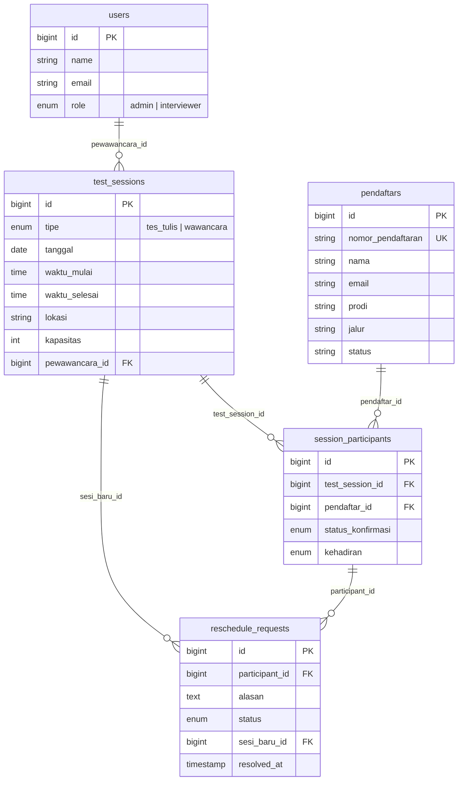

# Development Plan — Modul Penjadwalan Tes Seleksi PMB
## Vibe Coding & Venture SEVIMA

> **Nama**: Yusika Intan  
> **Tanggal**: 13 Juni 2026  
> **Modul**: Penjadwalan Tes Seleksi & Wawancara PMB  
> **Sistem Target**: Aplikasi PMB (React 18 + Laravel 12) — Existing

---

## BAGIAN 1 — Analisa Teknis

### 1.1 Identifikasi Pengguna

| No | Pengguna | Peran dalam Modul Penjadwalan |
|----|----------|-------------------------------|
| 1 | **Admin PMB** | Membuat sesi jadwal tes/wawancara, meng-assign pendaftar ke sesi, memantau kehadiran, mengirim notifikasi pengingat, dan mengelola permintaan reschedule. Sudah ada di sistem sebagai pengguna login — peran baru: manajemen jadwal. |
| 2 | **Calon Mahasiswa (Pendaftar)** | Melihat jadwal tes/wawancara yang ditetapkan, mengonfirmasi kehadiran, mengajukan reschedule jika berhalangan, dan menerima notifikasi pengingat. Sudah ada di sistem sebagai pendaftar — peran baru: peserta tes terjadwal. |
| 3 | **Pewawancara / Penguji** | Pengguna baru yang belum ada di sistem. Melihat daftar peserta yang di-assign ke sesinya, mencatat kehadiran peserta, dan melihat jadwal sesi yang ditugaskan kepadanya. Berbeda dari admin karena hanya memiliki akses terbatas pada sesi yang ditugaskan. |

---

### 1.2 Fitur Utama per Pengguna

#### Admin PMB

| No | Fitur | Deskripsi |
|----|-------|-----------|
| 1 | Buat Sesi Jadwal | Membuat sesi tes/wawancara baru dengan tanggal, waktu, lokasi/ruangan, kapasitas maksimal, dan tipe (tes tulis / wawancara) |
| 2 | Auto-Assign Pendaftar | Assign otomatis pendaftar berstatus "Lolos Seleksi" ke sesi berdasarkan prodi dan ketersediaan kapasitas |
| 3 | Kirim Notifikasi | Mengirim email pengingat jadwal ke peserta (manual trigger atau otomatis H-1) |
| 4 | Kelola Reschedule | Melihat dan menyetujui/menolak permintaan reschedule dari peserta |
| 5 | Dashboard Kehadiran | Melihat ringkasan kehadiran per sesi: hadir, tidak hadir, belum konfirmasi |

#### Calon Mahasiswa (Pendaftar)

| No | Fitur | Deskripsi |
|----|-------|-----------|
| 1 | Lihat Jadwal | Cek jadwal tes/wawancara menggunakan nomor pendaftaran (integrasi dengan halaman Cek Status yang sudah ada) |
| 2 | Konfirmasi Kehadiran | Mengonfirmasi bahwa akan hadir pada jadwal yang ditetapkan |
| 3 | Ajukan Reschedule | Mengajukan permintaan pindah jadwal dengan menyertakan alasan |
| 4 | Terima Pengingat | Menerima email pengingat otomatis H-1 sebelum jadwal |

#### Pewawancara / Penguji

| No | Fitur | Deskripsi |
|----|-------|-----------|
| 1 | Lihat Jadwal Sesi | Melihat daftar sesi yang ditugaskan kepadanya |
| 2 | Lihat Peserta per Sesi | Melihat daftar peserta yang di-assign ke sesinya |
| 3 | Catat Kehadiran | Menandai peserta hadir/tidak hadir pada saat pelaksanaan tes |

---

### 1.3 Tech Stack yang Dipilih

Stack utama tetap mengikuti sistem yang sudah ada. Berikut komponen **tambahan** untuk modul ini:

| Komponen Tambahan | Teknologi | Alasan |
|-------------------|-----------|--------|
| Kalender / Datepicker | **React DatePicker** (`react-datepicker`) | Ringan, mudah di-style dengan Tailwind, UX intuitif untuk memilih tanggal & waktu sesi |
| Pengiriman Email | **Laravel Mail + Mailtrap** (dev) / **SMTP** (prod) | Sudah built-in di Laravel, tidak perlu dependensi eksternal. Mailtrap untuk testing tanpa kirim email sungguhan |
| Job Queue (Reminder) | **Laravel Queue** (`database` driver) | Untuk mengirim email pengingat H-1 secara async tanpa blocking request. Driver `database` agar tidak perlu setup Redis |
| Task Scheduling | **Laravel Task Scheduling** (`schedule:run`) | Cron-like scheduler bawaan Laravel untuk trigger pengiriman reminder otomatis setiap hari |
| Notifikasi UI | **React Hot Toast** (`react-hot-toast`) | Notifikasi ringan di frontend untuk feedback aksi (jadwal dikonfirmasi, reschedule diajukan, dll.) |

---

### 1.4 Batasan & Asumsi

| No | Batasan / Asumsi | Jenis | Penjelasan |
|----|-----------------|-------|------------|
| 1 | Hanya pendaftar berstatus **"Lolos Seleksi"** yang bisa dijadwalkan | Asumsi | Modul penjadwalan membaca kolom `status` dari tabel `pendaftars` yang sudah ada. Pendaftar dengan status lain tidak akan muncul di daftar assign. |
| 2 | Satu pendaftar **hanya bisa di-assign ke 1 sesi per tipe** (1 sesi tes tulis + 1 sesi wawancara) | Batasan | Untuk menghindari konflik jadwal. Constraint `UNIQUE(pendaftar_id, tipe)` di tabel pivot. |
| 3 | Tabel `pendaftars` dan `users` **tidak dimodifikasi** | Batasan | Modul baru hanya menambah tabel baru dan mereferensikan tabel lama via foreign key. Tidak ada perubahan pada migration, model, atau controller yang sudah ada — agar fitur lama tetap berjalan. |
| 4 | Reschedule maksimal **1 kali** per pendaftar per sesi | Batasan | Mencegah penyalahgunaan dan menyederhanakan alur admin. |
| 5 | Pewawancara login menggunakan tabel `users` yang sudah ada, dibedakan via kolom `role` | Asumsi | Perlu menambahkan kolom `role` ke tabel `users` dengan default `'admin'` agar backward-compatible. Pewawancara mendapat role `'interviewer'`. |
| 6 | Email reminder hanya dikirim jika peserta belum konfirmasi kehadiran | Asumsi | Peserta yang sudah konfirmasi "Hadir" tidak perlu menerima reminder lagi. |

---

## BAGIAN 2 — Bisnis Proses & Flow

### 2.1 Flow Utama: Penjadwalan Tes Seleksi

```
[ADMIN] → Login ke dashboard admin (fitur sudah ada)
       ↓
[ADMIN] → Buka menu "Penjadwalan" di sidebar
       ↓
[ADMIN] → Klik "Buat Sesi Baru" → Isi form (tanggal, waktu mulai, waktu selesai,
          lokasi/ruangan, tipe: tes tulis/wawancara, kapasitas maks, pewawancara)
       ↓
[ADMIN] → Submit form → [SISTEM] Validasi input → Simpan sesi ke tabel `test_sessions`
       ↓ jika validasi gagal → tampilkan pesan error, kembali ke form
       ↓ jika berhasil
[ADMIN] → Klik "Assign Peserta" pada sesi yang baru dibuat
       ↓
[SISTEM] → Query tabel `pendaftars` WHERE status = "Lolos Seleksi"
           AND belum memiliki jadwal untuk tipe sesi ini
       ↓
[SISTEM] → Tampilkan daftar pendaftar yang eligible, dikelompokkan per prodi
       ↓
[ADMIN] → Pilih pendaftar (centang) → Klik "Assign ke Sesi Ini"
       ↓ jika kapasitas sesi sudah penuh → tampilkan warning, tolak assignment
       ↓ jika berhasil
[SISTEM] → Simpan data ke tabel `session_participants` (pendaftar_id + session_id)
       ↓
[SISTEM] → Kirim email notifikasi jadwal ke setiap pendaftar yang di-assign
       ↓
[PENDAFTAR] → Buka halaman "Cek Status" → Input nomor pendaftaran
       ↓
[SISTEM] → Query `pendaftars` + JOIN `session_participants` + JOIN `test_sessions`
       ↓
[PENDAFTAR] → Melihat detail jadwal (tanggal, waktu, lokasi, tipe tes)
       ↓
[PENDAFTAR] → Klik "Konfirmasi Kehadiran" → [SISTEM] Update status konfirmasi
       ↓
[SISTEM] → H-1 sebelum jadwal → Cek peserta yang belum konfirmasi
       ↓
[SISTEM] → Kirim email reminder otomatis via Laravel Queue
       ↓
[HARI-H]
[PEWAWANCARA] → Login → Buka sesi yang ditugaskan
       ↓
[PEWAWANCARA] → Centang kehadiran peserta satu per satu
       ↓
[SISTEM] → Update status kehadiran di `session_participants`
```

---

### 2.2 Flow Alternatif: Peserta Minta Reschedule

```
[PENDAFTAR] → Buka halaman "Cek Status" → Input nomor pendaftaran
       ↓
[SISTEM] → Tampilkan jadwal yang sudah di-assign
       ↓
[PENDAFTAR] → Klik "Ajukan Reschedule" (hanya muncul jika belum pernah reschedule)
       ↓
[PENDAFTAR] → Isi form alasan reschedule → Submit
       ↓
[SISTEM] → Simpan permintaan ke tabel `reschedule_requests` dengan status "Menunggu"
       ↓
[ADMIN] → Buka menu "Permintaan Reschedule" di dashboard
       ↓
[ADMIN] → Review permintaan → Pilih "Setujui" atau "Tolak"
       ↓ jika ditolak
[SISTEM] → Update status request → Kirim email ke pendaftar: "Reschedule ditolak"
       ↓ jika disetujui
[ADMIN] → Pilih sesi alternatif dari dropdown (sesi lain yang masih ada kapasitas)
       ↓
[SISTEM] → Pindahkan peserta dari sesi lama ke sesi baru di `session_participants`
       ↓
[SISTEM] → Update status request menjadi "Disetujui"
       ↓
[SISTEM] → Kirim email ke pendaftar: "Reschedule disetujui, jadwal baru: ..."
       ↓
[PENDAFTAR] → Buka "Cek Status" → Melihat jadwal baru yang sudah diupdate
```

---

### 2.3 Happy Path vs Error Path

#### ✅ Happy Path (Flow 2.1)

1. Admin membuat sesi → berhasil tersimpan
2. Admin assign pendaftar → kapasitas cukup, semua ter-assign
3. Sistem kirim email notifikasi → email terkirim ke semua peserta
4. Pendaftar cek status → jadwal tampil lengkap → konfirmasi kehadiran
5. H-1 reminder terkirim otomatis ke yang belum konfirmasi
6. Hari-H → pewawancara catat kehadiran → semua peserta hadir

#### ❌ Error Path

| No | Kondisi Error | Respons Sistem |
|----|--------------|----------------|
| 1 | **Kapasitas sesi penuh** — Admin mencoba assign peserta ke sesi yang sudah mencapai kapasitas maksimal | Sistem menampilkan pesan error: *"Sesi ini sudah penuh (kapasitas: X/X). Silakan buat sesi baru atau pilih sesi lain."* Assignment ditolak, tidak ada data yang tersimpan. |
| 2 | **Email gagal terkirim** — SMTP error atau email pendaftar tidak valid saat mengirim notifikasi jadwal | Sistem mencatat error di `failed_jobs` table (Laravel Queue). Admin melihat badge notifikasi "X email gagal terkirim" di dashboard. Admin bisa klik "Kirim Ulang" untuk retry pengiriman. Status assignment peserta tetap tersimpan (tidak di-rollback). |
| 3 | **Pendaftar sudah punya jadwal untuk tipe yang sama** — Admin mencoba assign pendaftar yang sudah memiliki jadwal tes tulis ke sesi tes tulis lain | Sistem menampilkan pesan error: *"Pendaftar [nama] sudah memiliki jadwal tes tulis pada [tanggal]. Gunakan fitur reschedule untuk mengubah jadwal."* Assignment ditolak via constraint `UNIQUE(pendaftar_id, tipe_sesi)`. |

---

## BAGIAN 3 — Alur Data

### 3.1 Alur Data: Proses Penjadwalan

```
[Admin — React: FormSesiJadwal.jsx]
       │ Input: tanggal, waktu, lokasi, tipe, kapasitas, pewawancara_id
       ▼
[Fetch API — POST /api/jadwal/sesi]
       │ JSON payload
       ▼
[Laravel — JadwalController@store]
       │ Validasi via StoreSesiRequest
       ▼
[Database — INSERT ke tabel `test_sessions`]
       │ Return: session_id
       ▼
[Admin — React: AssignPeserta.jsx]
       │ Admin memilih peserta
       ▼
[Fetch API — POST /api/jadwal/sesi/{id}/assign]
       │ JSON: { pendaftar_ids: [1, 2, 3] }
       ▼
[Laravel — JadwalController@assignPeserta]
       │ 1. Query `pendaftars` WHERE status = "Lolos Seleksi" (READ dari tabel lama)
       │ 2. Validasi kapasitas sesi
       │ 3. INSERT ke `session_participants` (WRITE ke tabel baru)
       │ 4. Dispatch SendJadwalNotification job ke Queue
       ▼
[Laravel Queue — SendJadwalNotification Job]
       │ Query `session_participants` + JOIN `pendaftars` (READ email)
       │ + JOIN `test_sessions` (READ detail jadwal)
       ▼
[Laravel Mail — SMTP]
       │ Kirim email ke setiap peserta
       ▼
[Pendaftar — Email Inbox]
       │ Terima notifikasi jadwal
```

---

### 3.2 Alur Data: Peserta Cek Jadwal

```
[Pendaftar — React: CekStatus.jsx (sudah ada, ditambah section jadwal)]
       │ Input: nomor_pendaftaran (misal: PMB-2025-1002)
       ▼
[Fetch API — GET /api/pendaftar/{nomor}]
       │ Endpoint sudah ada — response ditambah relasi jadwal
       ▼
[Laravel — PendaftarController@show (modifikasi minor)]
       │ Query: Pendaftar::where('nomor_pendaftaran', $nomor)
       │        ->with('sessionParticipants.testSession')  ← relasi baru
       ▼
[Database]
       │ READ `pendaftars` → JOIN `session_participants` → JOIN `test_sessions`
       ▼
[Laravel — JSON Response]
       │ Return: { pendaftar: {...}, jadwal: [{tanggal, waktu, lokasi, tipe, status_konfirmasi}] }
       ▼
[React — CekStatus.jsx]
       │ Render section baru "Jadwal Tes" di bawah info status pendaftaran
       │ Tampilkan: tabel jadwal + tombol "Konfirmasi Kehadiran" + tombol "Ajukan Reschedule"
       ▼
[Pendaftar — Klik "Konfirmasi Kehadiran"]
       ▼
[Fetch API — PATCH /api/jadwal/peserta/{participant_id}/konfirmasi]
       ▼
[Laravel — JadwalController@konfirmasiKehadiran]
       │ UPDATE `session_participants` SET status_konfirmasi = "Dikonfirmasi"
       ▼
[React — CekStatus.jsx]
       │ Update UI: tombol berubah jadi "✓ Sudah Dikonfirmasi" (disabled)
```

---

### 3.3 Data Sensitif

| No | Data / Field | Lokasi | Perlakuan Khusus | Alasan |
|----|-------------|--------|------------------|--------|
| 1 | **Email pendaftar** | `pendaftars.email` | Tidak ditampilkan di halaman publik Cek Status. Hanya visible di dashboard admin. | Data pribadi — mencegah scraping email. Sudah di-handle oleh endpoint yang ada, tapi perlu dipastikan endpoint jadwal publik juga tidak meng-expose email. |
| 2 | **Nomor HP pendaftar** | `pendaftars.nomor_hp` | Sama seperti email — hanya visible di admin. Tidak disertakan di response API publik. | Data pribadi yang bisa disalahgunakan. |
| 3 | **Token autentikasi admin & pewawancara** | `personal_access_tokens.token` | Disimpan di `sessionStorage` (bukan localStorage). Auto-clear saat tab ditutup. Dikirim via header `Authorization: Bearer`. | Mencegah token persist di browser setelah sesi selesai. Sanctum sudah meng-hash token di database. |
| 4 | **Alasan reschedule** | `reschedule_requests.alasan` | Hanya bisa diakses oleh admin yang login. Tidak di-expose ke endpoint publik manapun. | Bisa berisi informasi pribadi/sensitif (sakit, masalah keluarga, dll.). |

---

## BAGIAN 4 — ERD / Desain Database

### 4.1 Daftar Tabel

| No | Nama Tabel | Jenis | Deskripsi |
|----|-----------|-------|-----------|
| 1 | `users` | **Sudah ada** | Tabel user admin. Ditambah kolom `role` untuk membedakan admin dan pewawancara. |
| 2 | `pendaftars` | **Sudah ada** | Tabel pendaftar. Tidak diubah — hanya direferensikan via FK. |
| 3 | `test_sessions` | **Baru** | Menyimpan data sesi tes/wawancara (jadwal, lokasi, kapasitas). |
| 4 | `session_participants` | **Baru** | Tabel pivot yang menghubungkan pendaftar dengan sesi. Menyimpan status konfirmasi dan kehadiran. |
| 5 | `reschedule_requests` | **Baru** | Menyimpan permintaan reschedule dari peserta beserta status approval. |

---

### 4.2 Struktur Tiap Tabel

#### Modifikasi Tabel `users` (migration baru, bukan ubah migration lama)

| Kolom | Tipe Data | Constraint | Keterangan |
|-------|-----------|------------|------------|
| `role` | ENUM('admin', 'interviewer') | NOT NULL, DEFAULT 'admin' | Membedakan admin PMB dan pewawancara. Default 'admin' agar user lama tetap berfungsi. |

#### Tabel `test_sessions` (Baru)

| Kolom | Tipe Data | Constraint | Keterangan |
|-------|-----------|------------|------------|
| `id` | BIGINT UNSIGNED | PK, AUTO_INCREMENT | Primary key |
| `tipe` | ENUM('tes_tulis', 'wawancara') | NOT NULL | Jenis sesi |
| `tanggal` | DATE | NOT NULL | Tanggal pelaksanaan |
| `waktu_mulai` | TIME | NOT NULL | Jam mulai sesi |
| `waktu_selesai` | TIME | NOT NULL | Jam selesai sesi |
| `lokasi` | VARCHAR(255) | NOT NULL | Nama ruangan/lokasi |
| `kapasitas` | INTEGER | NOT NULL, DEFAULT 30 | Jumlah maksimal peserta |
| `pewawancara_id` | BIGINT UNSIGNED | NULLABLE, FK → `users.id` | ID pewawancara (null untuk tes tulis) |
| `catatan` | TEXT | NULLABLE | Catatan tambahan dari admin |
| `created_at` | TIMESTAMP | | Laravel timestamp |
| `updated_at` | TIMESTAMP | | Laravel timestamp |

#### Tabel `session_participants` (Baru)

| Kolom | Tipe Data | Constraint | Keterangan |
|-------|-----------|------------|------------|
| `id` | BIGINT UNSIGNED | PK, AUTO_INCREMENT | Primary key |
| `test_session_id` | BIGINT UNSIGNED | NOT NULL, FK → `test_sessions.id`, ON DELETE CASCADE | Referensi ke sesi |
| `pendaftar_id` | BIGINT UNSIGNED | NOT NULL, FK → `pendaftars.id`, ON DELETE CASCADE | Referensi ke pendaftar |
| `status_konfirmasi` | ENUM('Belum Konfirmasi', 'Dikonfirmasi', 'Tidak Hadir') | NOT NULL, DEFAULT 'Belum Konfirmasi' | Status konfirmasi peserta |
| `kehadiran` | ENUM('Belum', 'Hadir', 'Tidak Hadir') | NOT NULL, DEFAULT 'Belum' | Status kehadiran aktual |
| `created_at` | TIMESTAMP | | Laravel timestamp |
| `updated_at` | TIMESTAMP | | Laravel timestamp |
| — | — | UNIQUE(`pendaftar_id`, `test_session_id`) | Satu pendaftar hanya bisa di-assign 1x per sesi |

#### Tabel `reschedule_requests` (Baru)

| Kolom | Tipe Data | Constraint | Keterangan |
|-------|-----------|------------|------------|
| `id` | BIGINT UNSIGNED | PK, AUTO_INCREMENT | Primary key |
| `participant_id` | BIGINT UNSIGNED | NOT NULL, FK → `session_participants.id`, ON DELETE CASCADE | Referensi ke assignment peserta |
| `alasan` | TEXT | NOT NULL | Alasan pengajuan reschedule |
| `status` | ENUM('Menunggu', 'Disetujui', 'Ditolak') | NOT NULL, DEFAULT 'Menunggu' | Status approval |
| `sesi_baru_id` | BIGINT UNSIGNED | NULLABLE, FK → `test_sessions.id` | Sesi tujuan reschedule (diisi saat disetujui) |
| `catatan_admin` | TEXT | NULLABLE | Catatan dari admin saat approve/reject |
| `resolved_at` | TIMESTAMP | NULLABLE | Waktu keputusan dibuat |
| `created_at` | TIMESTAMP | | Laravel timestamp |
| `updated_at` | TIMESTAMP | | Laravel timestamp |

---

### 4.3 Relasi Antar Tabel

```
[users] ---(1:N)--- [test_sessions]
Keterangan: Satu pewawancara (user dengan role 'interviewer') bisa ditugaskan ke
banyak sesi wawancara. FK: test_sessions.pewawancara_id → users.id.
Relasi ini memungkinkan pewawancara melihat daftar sesi yang ditugaskan kepadanya.

[test_sessions] ---(1:N)--- [session_participants]
Keterangan: Satu sesi tes memiliki banyak peserta. FK: session_participants.test_session_id
→ test_sessions.id. ON DELETE CASCADE — jika sesi dihapus, semua assignment peserta ikut terhapus.

[pendaftars] ---(1:N)--- [session_participants]
Keterangan: Satu pendaftar bisa memiliki assignment di beberapa sesi (misal: 1 sesi
tes tulis + 1 sesi wawancara). FK: session_participants.pendaftar_id → pendaftars.id.
Ini adalah titik integrasi utama antara modul baru dan data lama — modul penjadwalan
MEMBACA data pendaftar tanpa MENGUBAH tabel pendaftars.

[session_participants] ---(1:N)--- [reschedule_requests]
Keterangan: Satu assignment peserta bisa memiliki beberapa permintaan reschedule
(meskipun dibatasi 1 yang aktif). FK: reschedule_requests.participant_id →
session_participants.id. Relasi melalui participant (bukan langsung ke pendaftar)
agar konteks sesi mana yang di-reschedule tetap jelas.

[test_sessions] ---(1:N)--- [reschedule_requests]
Keterangan: Satu sesi bisa menjadi tujuan reschedule dari banyak peserta.
FK: reschedule_requests.sesi_baru_id → test_sessions.id. Kolom ini NULLABLE
karena hanya diisi saat admin menyetujui reschedule dan memilih sesi pengganti.
```

#### Diagram Relasi



---

### 4.4 Indexing

| No | Tabel | Kolom | Tipe Index | Alasan |
|----|-------|-------|------------|--------|
| 1 | `test_sessions` | `tanggal` | INDEX | Sering digunakan di WHERE clause untuk filter sesi berdasarkan tanggal (tampilan kalender, filter "Jadwal Hari Ini"). |
| 2 | `test_sessions` | `tipe` | INDEX | Digunakan untuk filter sesi berdasarkan tipe (tes tulis vs wawancara) di dashboard admin. |
| 3 | `test_sessions` | `pewawancara_id` | INDEX (FK) | Foreign key — digunakan di JOIN saat pewawancara melihat daftar sesi yang ditugaskan kepadanya. |
| 4 | `session_participants` | `test_session_id` | INDEX (FK) | Foreign key — digunakan di JOIN saat menampilkan daftar peserta per sesi. Query ini terjadi setiap kali admin/pewawancara membuka detail sesi. |
| 5 | `session_participants` | `pendaftar_id` | INDEX (FK) | Foreign key — digunakan di JOIN saat pendaftar cek jadwal via nomor pendaftaran. Query paling sering dari sisi publik. |
| 6 | `session_participants` | (`pendaftar_id`, `test_session_id`) | UNIQUE INDEX | Mencegah duplikasi assignment dan digunakan untuk validasi saat assign peserta baru. |
| 7 | `session_participants` | `status_konfirmasi` | INDEX | Digunakan di WHERE clause untuk query "peserta yang belum konfirmasi" — dipanggil setiap hari oleh scheduled job reminder H-1. |
| 8 | `reschedule_requests` | `status` | INDEX | Digunakan di WHERE clause untuk filter "permintaan yang masih Menunggu" di dashboard admin. |
| 9 | `reschedule_requests` | `participant_id` | INDEX (FK) | Foreign key — digunakan untuk validasi apakah peserta sudah pernah mengajukan reschedule (max 1x). |

---

## BAGIAN 5 — Prompt Siap Pakai untuk AI

```
[KONTEKS]
Saya memiliki aplikasi PMB (Penerimaan Mahasiswa Baru) yang sudah berjalan dengan stack:
- Frontend: React 18 + Vite 5 + Tailwind CSS 3 (http://localhost:5173)
- Backend: Laravel 12 + Sanctum auth (http://localhost:8000/api)
- Database: SQLite (dev)

Fitur yang sudah berjalan:
- Formulir pendaftaran online + generate nomor otomatis (PMB-2025-XXXX)
- Cek status pendaftaran by nomor pendaftar (GET /api/pendaftar/{nomor})
- Dashboard admin: statistik per prodi & jalur, tabel pendaftar, update status, export CSV
- Login admin via Sanctum token (POST /api/auth/login), token disimpan di sessionStorage
- Heregistrasi untuk pendaftar yang lolos seleksi

Tabel yang sudah ada:
- `users` (id, name, email, password) — admin login
- `pendaftars` (id, nomor_pendaftaran, nama, nomor_hp, email, asal_sekolah, prodi, jalur, status, heregistrasi_at)
- `personal_access_tokens` — Sanctum tokens

Konvensi kode yang sudah dipakai:
- Fetch API dengan custom wrapper (src/utils/api.js), bukan Axios
- Window routing (tanpa react-router)
- Komponen di src/components/pmb/, halaman di src/pages/
- Controller di app/Http/Controllers/Api/, request validation di app/Http/Requests/
- API prefix: /api, response format JSON { success: bool, data: ... }

[TUJUAN]
Tambahkan modul penjadwalan tes seleksi & wawancara PMB ke sistem yang sudah ada.
Modul ini mendigitalisasi proses penjadwalan yang sebelumnya manual (via WhatsApp).
Scope: Admin membuat sesi jadwal → assign pendaftar yang "Lolos Seleksi" → peserta melihat
& konfirmasi jadwal → reminder otomatis H-1 → pewawancara catat kehadiran → peserta bisa
ajukan reschedule.

[FITUR]
Fitur baru yang harus diimplementasikan (JANGAN mengulang fitur yang sudah ada):

Admin PMB:
1. CRUD sesi jadwal tes (tanggal, waktu, lokasi, kapasitas, tipe: tes_tulis/wawancara)
2. Assign pendaftar berstatus "Lolos Seleksi" ke sesi (dengan validasi kapasitas)
3. Dashboard kehadiran per sesi (hadir/tidak hadir/belum konfirmasi)
4. Kelola permintaan reschedule (setujui + pilih sesi alternatif, atau tolak)
5. Kirim email notifikasi jadwal + reminder otomatis H-1

Calon Mahasiswa:
1. Lihat jadwal tes di halaman Cek Status (tambah section di CekStatus.jsx yang sudah ada)
2. Konfirmasi kehadiran via tombol
3. Ajukan reschedule (max 1x) dengan form alasan

Pewawancara (role baru):
1. Login dengan role "interviewer" (gunakan tabel users + kolom role baru)
2. Lihat sesi yang ditugaskan + daftar peserta per sesi
3. Catat kehadiran peserta (centang hadir/tidak hadir)

[CONSTRAINT]
Database — Tambahkan tabel baru, JANGAN ubah tabel `pendaftars` dan migration yang sudah ada:
- Tambah kolom `role` ENUM('admin','interviewer') DEFAULT 'admin' ke `users` (migration baru)
- Tabel `test_sessions`: id, tipe, tanggal, waktu_mulai, waktu_selesai, lokasi, kapasitas,
  pewawancara_id (FK→users), catatan, timestamps
- Tabel `session_participants`: id, test_session_id (FK→test_sessions), pendaftar_id
  (FK→pendaftars), status_konfirmasi ENUM('Belum Konfirmasi','Dikonfirmasi','Tidak Hadir'),
  kehadiran ENUM('Belum','Hadir','Tidak Hadir'), timestamps.
  UNIQUE(pendaftar_id, test_session_id)
- Tabel `reschedule_requests`: id, participant_id (FK→session_participants), alasan,
  status ENUM('Menunggu','Disetujui','Ditolak'), sesi_baru_id (FK nullable→test_sessions),
  catatan_admin, resolved_at, timestamps

Integrasi:
- Endpoint cek jadwal publik: tambahkan relasi jadwal ke response GET /api/pendaftar/{nomor}
  yang sudah ada, JANGAN buat endpoint terpisah untuk cek jadwal
- Email: gunakan Laravel Mail + Queue (database driver), Mailtrap untuk dev
- Reminder: Laravel Task Scheduling, kirim email H-1 ke peserta yang belum konfirmasi
- Auth pewawancara: gunakan Sanctum yang sudah ada, bedakan akses via role middleware
- Semua fitur lama HARUS tetap berjalan tanpa perubahan (regresi = gagal)

API Endpoints baru:
- POST   /api/jadwal/sesi                         → Buat sesi (admin)
- GET    /api/jadwal/sesi                         → List semua sesi (admin)
- GET    /api/jadwal/sesi/{id}                    → Detail sesi + peserta (admin/interviewer)
- PUT    /api/jadwal/sesi/{id}                    → Update sesi (admin)
- DELETE /api/jadwal/sesi/{id}                    → Hapus sesi (admin)
- POST   /api/jadwal/sesi/{id}/assign             → Assign peserta ke sesi (admin)
- PATCH  /api/jadwal/peserta/{id}/konfirmasi      → Konfirmasi kehadiran (publik)
- PATCH  /api/jadwal/peserta/{id}/kehadiran       → Catat kehadiran (interviewer)
- POST   /api/jadwal/peserta/{id}/reschedule      → Ajukan reschedule (publik)
- GET    /api/jadwal/reschedule                   → List permintaan reschedule (admin)
- PATCH  /api/jadwal/reschedule/{id}              → Approve/reject reschedule (admin)
- POST   /api/jadwal/sesi/{id}/notify             → Kirim notifikasi manual (admin)

[TAMPILAN]
Konsisten dengan UI yang sudah ada (Tailwind CSS, warna biru-putih-abu):

Admin Dashboard (tambah tab/menu baru):
- Tab "Penjadwalan" → Tabel daftar sesi (kolom: tanggal, tipe, lokasi, kapasitas terisi/total)
- Modal/page "Buat Sesi" → Form dengan datepicker, timepicker, dropdown tipe & pewawancara
- Detail Sesi → Tabel peserta (nama, prodi, status konfirmasi, kehadiran) + tombol assign
- Tab "Reschedule" → Tabel permintaan (badge status: kuning=Menunggu, hijau=Disetujui, merah=Ditolak)
- Statistics card baru: "Total Sesi Tes" dan "Kehadiran Hari Ini"

Halaman Cek Status (extend yang sudah ada):
- Tambah section "Jadwal Tes" di bawah info status pendaftaran
- Card per jadwal: ikon kalender, tanggal/waktu, lokasi, badge tipe tes
- Tombol "Konfirmasi Kehadiran" (hijau) — disable setelah dikonfirmasi
- Tombol "Ajukan Reschedule" (kuning) — hilang setelah 1x diajukan

Pewawancara Dashboard:
- Halaman sederhana: list sesi → klik → daftar peserta dengan checkbox kehadiran
- Warna accent: sama dengan admin (konsistensi)
```

---

## Referensi

- **Stack**: React 18, Vite 5, Tailwind CSS 3, Laravel 12, Sanctum, SQLite
- **Event**: Vibe Coding & Venture — SEVIMA, Juni 2026
- **Konteks**: Pengembangan lanjutan sistem PMB yang sudah berjalan
