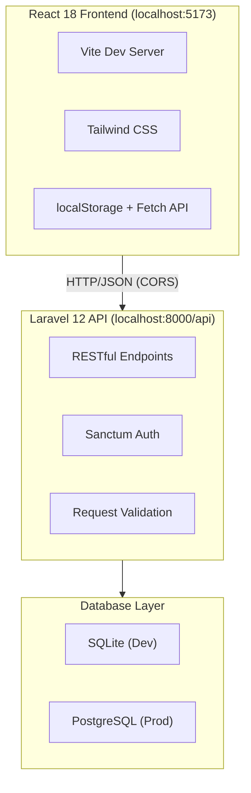
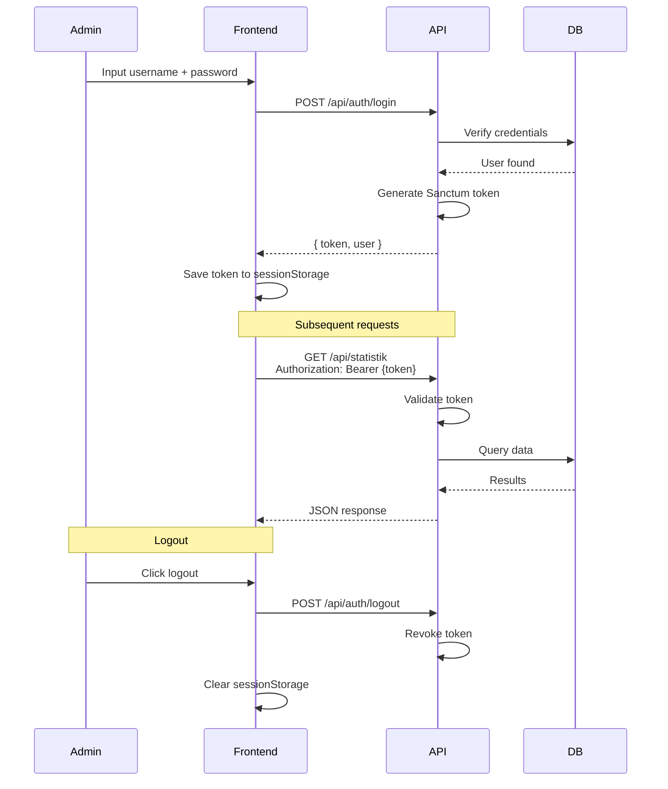

# 📚 Development Plan — Sistem Penerimaan Mahasiswa Baru (PMB)

> **Project**: PMB 2025 — Full Stack Prototype  
> **Event**: Vibe Coding & Venture — SEVIMA  
> **Date**: June 2026  
> **Status**: ✅ Complete (3 Phases)  
> **Dev Approach**: 100% AI-Assisted (GitHub Copilot Agent)

---

## 1. Ringkasan Proyek

Sistem Penerimaan Mahasiswa Baru (PMB) adalah aplikasi web full-stack untuk mengelola proses pendaftaran mahasiswa baru di universitas. Sistem ini mencakup halaman publik untuk pendaftaran & pengecekan status, serta dashboard admin untuk monitoring, seleksi, dan ekspor data.

---

## 2. Arsitektur Sistem



| Layer    | Teknologi                            |
| -------- | ------------------------------------ |
| Frontend | React 18 + Vite 5 + Tailwind CSS 3  |
| Backend  | Laravel 12 + Sanctum                |
| Database | SQLite (dev) / PostgreSQL (prod)     |
| Auth     | Sanctum Token-Based Authentication   |
| API      | RESTful JSON                         |

---

## 3. Struktur Direktori

```
admission-app/
├── .gitignore
├── claude.md                           # AI context + session log
├── agent.md                            # AI agent instructions
├── prd.md                              # Product requirements
├── skill.md                            # Technical conventions
│
├── pmb-frontend/                       # ── React + Vite ──
│   ├── src/
│   │   ├── components/
│   │   │   ├── ui/                     # Button, Input (reusable)
│   │   │   └── pmb/
│   │   │       ├── FormPendaftaran.jsx
│   │   │       ├── CekStatus.jsx       # + Heregistrasi UI
│   │   │       ├── AdminLogin.jsx      # Sanctum login
│   │   │       ├── TabelPendaftar.jsx
│   │   │       └── StatusBadge.jsx
│   │   ├── pages/
│   │   │   ├── Home.jsx
│   │   │   └── Admin.jsx               # Dashboard + stats
│   │   ├── hooks/
│   │   │   ├── useLocalStorage.js
│   │   │   └── usePendaftar.js
│   │   ├── utils/
│   │   │   ├── api.js                  # Fetch wrapper + token mgmt
│   │   │   └── generateNomor.js
│   │   ├── constants/index.js
│   │   └── App.jsx
│   ├── .env                            # VITE_API_URL
│   ├── vite.config.js
│   ├── tailwind.config.js
│   └── package.json
│
└── pmb-backend/                        # ── Laravel 12 ──
    ├── app/Http/Controllers/Api/
    │   ├── PendaftarController.php      # CRUD + stats + export + heregistrasi
    │   └── AdminAuthController.php      # Sanctum login/logout
    ├── app/Http/Requests/
    │   ├── StorePendaftarRequest.php    # Validation rules
    │   └── UpdateStatusRequest.php
    ├── app/Models/
    │   ├── User.php                    # HasApiTokens
    │   └── Pendaftar.php               # Main model + constants
    ├── database/
    │   ├── migrations/
    │   │   ├── create_users_table
    │   │   ├── create_pendaftars_table
    │   │   └── add_heregistrasi_to_pendaftars
    │   ├── seeders/
    │   │   ├── DatabaseSeeder.php
    │   │   ├── AdminSeeder.php         # admin / pmb2025
    │   │   └── PendaftarSeeder.php     # 3 dummy records
    │   └── database.sqlite
    ├── routes/api.php                  # 9 endpoints
    ├── config/cors.php                 # Allow localhost:5173
    └── .env
```

---

## 4. Database Schema

### Tabel `users`

| Kolom               | Tipe        | Keterangan     |
| -------------------- | ----------- | -------------- |
| `id`                 | PK          | Auto increment |
| `name`               | string      |                |
| `email`              | string      | Unique         |
| `password`           | string      | Hashed         |
| `email_verified_at`  | timestamp   | Nullable       |
| `created_at`         | timestamp   |                |
| `updated_at`         | timestamp   |                |

### Tabel `pendaftars`

| Kolom                | Tipe        | Keterangan                                      |
| -------------------- | ----------- | ------------------------------------------------ |
| `id`                 | PK          | Auto increment                                   |
| `nomor_pendaftaran`  | string      | Unique, format: `PMB-2025-XXXX`                 |
| `nama`               | string      | Nama lengkap                                     |
| `nomor_hp`           | string      | Nomor telepon                                    |
| `email`              | string      |                                                  |
| `asal_sekolah`       | string      | Asal sekolah/institusi                           |
| `prodi`              | string      | Enum: `TI`, `SI`, `Manajemen`, `Akuntansi`      |
| `jalur`              | string      | Enum: `SNBT`, `Mandiri`, `Prestasi`             |
| `status`             | string      | Default: `Menunggu`                              |
| `heregistrasi_at`    | timestamp   | Nullable, diisi saat konfirmasi heregistrasi     |
| `created_at`         | timestamp   |                                                  |
| `updated_at`         | timestamp   |                                                  |

### Tabel `personal_access_tokens`

> Auto-generated oleh Laravel Sanctum untuk menyimpan API token.

---

## 5. API Endpoints

### 🔐 Authentication

| Method | Endpoint            | Auth | Deskripsi              |
| ------ | ------------------- | ---- | ---------------------- |
| POST   | `/api/auth/login`   | ✗    | Login admin, get token |
| POST   | `/api/auth/logout`  | ✓    | Revoke token           |

### 📋 Applicants (Pendaftar)

| Method | Endpoint                                | Auth | Deskripsi                       |
| ------ | --------------------------------------- | ---- | ------------------------------- |
| POST   | `/api/pendaftar`                        | ✗    | Daftar mahasiswa baru           |
| GET    | `/api/pendaftar`                        | ✓    | List semua pendaftar (admin)    |
| GET    | `/api/pendaftar/{nomor}`                | ✗    | Cek status by nomor pendaftaran |
| PATCH  | `/api/pendaftar/{id}/status`            | ✓    | Update status (admin)           |
| POST   | `/api/pendaftar/{nomor}/heregistrasi`   | ✗    | Konfirmasi heregistrasi         |

### 📊 Statistics & Export

| Method | Endpoint                      | Auth | Deskripsi                             |
| ------ | ----------------------------- | ---- | ------------------------------------- |
| GET    | `/api/statistik`              | ✓    | Statistik (total, per_prodi, per_jalur) |
| GET    | `/api/pendaftar/export/csv`   | ✓    | Download CSV file (UTF-8 BOM)         |

---

## 6. Fitur Aplikasi

### 6.1 Halaman Publik

| Fitur             | Deskripsi                                                                                           |
| ----------------- | --------------------------------------------------------------------------------------------------- |
| **Home**          | Landing page dengan tab navigasi                                                                    |
| **Form Daftar**   | Form pendaftaran dengan auto-generate nomor `PMB-2025-XXXX`, validasi frontend & backend            |
| **Cek Status**    | Input nomor pendaftaran → tampilkan info (nama, prodi, jalur, status) + tombol heregistrasi kondisional |

### 6.2 Admin Dashboard

| Fitur               | Deskripsi                                                                  |
| -------------------- | -------------------------------------------------------------------------- |
| **Login**            | Sanctum token-based auth (`admin / pmb2025`)                               |
| **Statistics Cards** | Total pendaftar + breakdown status (Menunggu, Lolos, Tidak Lolos)          |
| **Progress Bars**    | Bar chart per Prodi (biru) dan per Jalur (amber)                           |
| **Tabel Pendaftar**  | Realtime filtering + inline status update + tanggal pendaftaran            |
| **Export CSV**       | Download data pendaftar (UTF-8 BOM untuk kompatibilitas Excel)             |

---

## 7. Tahapan Pengembangan

### Phase 1 — Core Prototype ✅

> **Fokus**: UI + localStorage (tanpa backend)

- [x] Setup project React + Vite + Tailwind CSS
- [x] Buat komponen UI reusable (Button, Input)
- [x] Implementasi `FormPendaftaran.jsx` — form pendaftaran + validasi
- [x] Implementasi `CekStatus.jsx` — cek status pendaftar
- [x] Implementasi `TabelPendaftar.jsx` — tabel data pendaftar
- [x] Buat `StatusBadge.jsx` — badge status visual
- [x] Buat halaman `Home.jsx` dengan tab navigasi
- [x] Custom hook `useLocalStorage.js` untuk persistensi data
- [x] Custom hook `usePendaftar.js` untuk logic pendaftar
- [x] Utility `generateNomor.js` untuk auto-generate nomor pendaftaran
- [x] Konstanta program studi & jalur di `constants/index.js`
- [x] Routing via window navigation (tanpa react-router)

---

### Phase 2 — Backend Integration ✅

> **Fokus**: Laravel API + koneksi frontend ↔ backend

- [x] Setup project Laravel 12
- [x] Konfigurasi SQLite untuk development
- [x] Buat migration `create_users_table`
- [x] Buat migration `create_pendaftars_table`
- [x] Buat model `User.php` dan `Pendaftar.php`
- [x] Buat `PendaftarController.php` — CRUD endpoints
- [x] Buat `StorePendaftarRequest.php` — validasi input
- [x] Buat `UpdateStatusRequest.php` — validasi update status
- [x] Definisikan routes di `routes/api.php`
- [x] Konfigurasi CORS (`config/cors.php`) untuk `localhost:5173`
- [x] Buat `AdminSeeder.php` — seed admin user
- [x] Buat `PendaftarSeeder.php` — 3 dummy records
- [x] Buat `api.js` utility — Fetch wrapper + token management
- [x] Integrasi frontend ke API (ganti localStorage → API calls)
- [x] Halaman `Admin.jsx` — dashboard dasar

---

### Phase 3 — Full System ✅

> **Fokus**: Auth, statistik, export, heregistrasi

- [x] Implementasi Sanctum token-based authentication
- [x] Buat `AdminAuthController.php` — login/logout endpoints
- [x] Buat `AdminLogin.jsx` — form login admin
- [x] Token storage di `sessionStorage` (key: `pmb_admin_token`)
- [x] Auto-attach token ke semua request via `Authorization: Bearer`
- [x] Endpoint `/api/statistik` — total, per_prodi, per_jalur
- [x] Statistics cards di dashboard admin
- [x] Progress bars — per Prodi (biru) & per Jalur (amber)
- [x] Realtime filtering di tabel pendaftar
- [x] Inline status update (dropdown) di tabel
- [x] Migration `add_heregistrasi_to_pendaftars` — kolom `heregistrasi_at`
- [x] Endpoint `/api/pendaftar/{nomor}/heregistrasi`
- [x] Tombol heregistrasi di `CekStatus.jsx` (kondisional: hanya untuk "Lolos Seleksi")
- [x] Endpoint `/api/pendaftar/export/csv` — export CSV
- [x] UTF-8 BOM encoding untuk kompatibilitas Excel
- [x] Protected admin routes (require auth token)

---

## 8. Authentication Flow



---

## 9. Prerequisites & Setup

### System Requirements

| Komponen    | Versi Minimum          |
| ----------- | ---------------------- |
| Node.js     | 18+                    |
| npm         | Bundled with Node.js   |
| PHP         | 8.3+                   |
| Composer    | Latest                 |
| SQLite      | Dev (built-in PHP ext) |
| PostgreSQL  | 17+ (production only)  |

### Instalasi & Menjalankan

```bash
# 1. Frontend
cd pmb-frontend
npm install
npm run dev                    # → http://localhost:5173

# 2. Backend
cd pmb-backend
composer install
cp .env.example .env
php artisan key:generate
touch database/database.sqlite
php artisan migrate --seed
php artisan serve --port=8000  # → http://localhost:8000
```

### Verifikasi

| Check     | URL / Command                                    | Expected                      |
| --------- | ------------------------------------------------ | ----------------------------- |
| Frontend  | `http://localhost:5173`                           | Landing page tampil           |
| Admin     | `http://localhost:5173/admin`                     | Login page → `admin/pmb2025`  |
| API       | `curl http://localhost:8000/api/statistik`        | 401 Unauthorized (expected)   |

---

## 10. Keputusan Teknis

| Keputusan                          | Alasan                                                    |
| ---------------------------------- | --------------------------------------------------------- |
| React 18 (hooks)                   | Modern, component-based, hooks API untuk state management |
| Vite 5                             | Dev server cepat, HMR instan                              |
| Laravel 12 + Sanctum               | PHP modern, auth token ringan tanpa OAuth                 |
| Fetch API (tanpa Axios)            | Native browser API, custom wrapper lebih ringan           |
| Tailwind CSS only                  | Utility-first, konsisten, tanpa custom CSS                |
| Window routing (tanpa react-router)| Lebih sederhana untuk prototype                           |
| SQLite (dev) / PostgreSQL (prod)   | Zero-config untuk dev, robust untuk prod                  |
| sessionStorage untuk token         | Auto-clear saat tab ditutup, lebih aman dari localStorage |

---

## 11. Production Deployment

### Frontend Build

```bash
cd pmb-frontend
npm run build    # → output ke /dist
```

### Backend (PostgreSQL)

```bash
# Update .env
DB_CONNECTION=pgsql
DB_HOST=your_server
DB_DATABASE=pmb_prod
DB_USERNAME=your_user
DB_PASSWORD=your_password

# Migrate & seed
php artisan migrate --env=production
php artisan db:seed --class=AdminSeeder
```

---

## 12. Troubleshooting

| Masalah                     | Solusi                                                                          |
| --------------------------- | ------------------------------------------------------------------------------- |
| Port sudah digunakan        | `lsof -i :8000` → `kill -9 <PID>` atau gunakan `--port=8001`                   |
| CORS error                  | Cek `config/cors.php` → `allowed_origins` harus include `http://localhost:5173` |
| SQLite file not found       | `touch database/database.sqlite` → `php artisan migrate --seed`                 |
| Token expired               | Clear `sessionStorage` → login ulang                                            |
| Build error (frontend)      | `npm install --force` → `npm run build`                                         |
| Build error (backend)       | `composer install --no-dev`                                                     |

---

## 13. File Dokumentasi Pendukung

| File         | Fungsi                                          |
| ------------ | ----------------------------------------------- |
| `prd.md`     | Product requirements, fitur, user personas      |
| `skill.md`   | Konvensi kode, struktur, patterns               |
| `agent.md`   | Perilaku AI agent + response rules              |
| `claude.md`  | Session log + phase status + progress tracking  |

---
